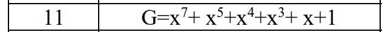
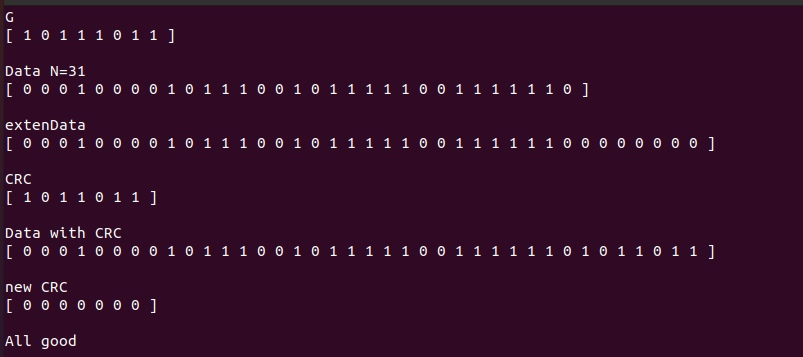
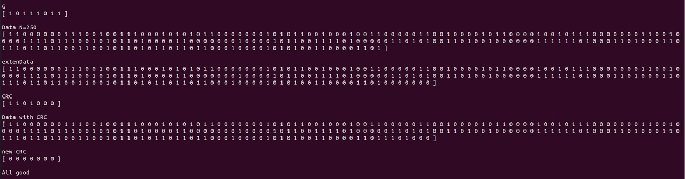
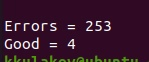

# Лабораторная работа 5
### Циклический избыточный код. CRC

#### Задачи 
1. Напишите программу на языке С/С++ для вычисления CRC для пакета
данных длиной N бит (N= 20 + порядковый номер в журнале) и
определения факта наличия ошибки при передаче пакета по каналу связи.

2. Порождающий полином G для делителя выберите в соответствии с
вариантом. Номер варианта – порядковый номер в журнале группы. 

3. Добавьте полученный остаток от деления на G к пакету исходными
данными и на приемной стороне вычислите повторно остаток от деления
пакета с данными+CRC на полином G. Определите есть ли ошибка в
принятом пакете. Выведите в окно терминала полученное значение CRC
и отчет об ошибках в принятом пакете

4. Возьмите N, равное 250 битам. Проделайте п.1-3

5. Сделайте цикл из 250+CRC length итераций и в этом цикле по очереди
искажайте по одному биту – с 0-го до 250+CRC-1, проверьте в
соответствии с п.3 обнаружена ли ошибка на приемной стороне и
выполните подсчет того сколько раз за этот цикл приемник обнаружил и
не обнаружил ошибки. Результат выведите в окно терминала

6. Составьте отчет. Отчет должен содержать титульный лист, содержание,
цель и задачи работы, теоретические сведения, исходные данные, этапы
выполнения работы, сопровождаемые скриншотами и графиками,
демонстрирующими успешность выполнения, и промежуточными
выводами, результирующими таблицами, ответы на контрольные
вопросы, и заключение и ссылка в виде QR-кода на репозиторий с
кодом (git).

#### Пример работы программы

